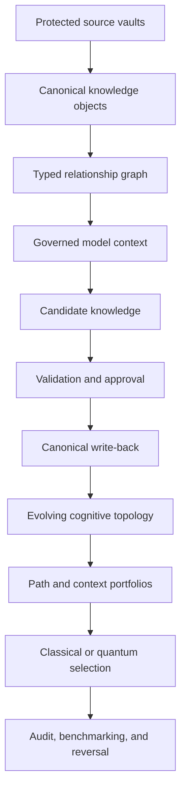

# AI-Enhanced Institutional Knowledge

### From protected knowledge vaults to governed cognitive evolution

**Alejandro Reynoso**  
Judge Business School, University of Cambridge  
MFin Pedagogical Edition · July 2026

---

## Overview

This repository presents an end-to-end framework for building **AI-enhanced
institutional knowledge**: a governed system through which an organization can
connect its protected knowledge resources to large language models, generate
new candidate knowledge, validate and authorize what enters institutional
memory, and study how that memory evolves over time.

The central proposition is that the strategic unit of organizational AI is not
the model alone. It is the complete institutional system that combines:

1. human judgment;
2. structured and unstructured organizational knowledge;
3. generative and reasoning models; and
4. governed, AI-enhanced institutional memory.

The architecture is designed to help corporations integrate AI into their
processes while preserving control over proprietary information. A model does
not receive unrestricted access to a knowledge vault. Instead, a governed
context-construction layer retrieves the minimum eligible evidence for a
declared purpose and access profile. Model outputs return as **candidate
knowledge** and must pass deterministic controls, provenance checks, policy
rules, and—where required—human approval before they can become canonical
institutional knowledge.

The repository is both a research collection and a classroom instrument. The
papers provide the conceptual, governance, economic, and epistemic framework.
The Colab notebooks make that framework executable, one stage at a time.

> **The main paper and the notebooks should be studied together.** The paper
> explains why each architectural component is necessary; the notebooks show
> what the component does, what it produces, and what fails when it is omitted.

---

## Main paper

### [AI-Enhanced Institutional Knowledge](./AI%20ENHANCED%20INSTITUTIONAL%20KNOWLEDGE.pdf)

*The Four-Legged Architecture from Protected Knowledge Vaults to Governed
Cognitive Evolution*

This is the synthesis paper and the intellectual spine of the repository. It
develops the complete pipeline:



The paper addresses the complete institutional problem: corpus discovery,
canonical representation, provenance, governance, graph construction, model
access, question-induced knowledge, navigation policy, recursive write-back,
topological divergence, advanced context selection, multi-agent deliberation,
validation, confidentiality, organizational ownership, and dependency-aware
reversal.

The architecture is **designed to preserve proprietary control**; it does not
claim that confidentiality follows automatically from using a vault or an LLM.
Production confidentiality also depends on identity and access management,
model endpoints, encryption, retention, data residency, provider terms,
monitoring, and the treatment of relations whose existence may itself be
sensitive.

---

## Supporting papers

The supporting papers deepen specific parts of the main architecture. They are
not competing versions of the main paper; each isolates one important mechanism
and connects it to the relevant notebooks.

| Paper | Role in the architecture | Principal notebooks |
|---|---|---|
| [Governance Before Cognition](./supporting_papers/GOVERNANCE%20BEFORE%20COGNITION.pdf) | Establishes the distinction between generated candidates and authoritative institutional knowledge. Develops eligibility, approval, provenance, quarantine, supersession, auditability, and reversal. | NB01–NB03; NB16; NB21–NB22 |
| [Knowledge Engineering](./supporting_papers/KNOWLEDGE%20ENGINEERING.pdf) | Explains how document vaults become governed, typed, evolving corporate intelligence. Develops the three-vault preservation contract, controlled ontology, decision objects, temporal supersession, and layered validation. | NB08–NB12 |
| [Navigation-Conditioned Knowledge Evolution](./supporting_papers/NAVIGATION%20CONDITIONED%20KNOWLEDGE%20EVOLUTION.pdf) | Shows that retrieval is not neutral: different navigation policies produce different contexts, answers, write-backs, and eventually different graph topologies. | NB13–NB16 |
| [Question-Induced Knowledge Architecture](./supporting_papers/QUESTION%20INDUCED%20KNOWLEDGE%20ARCHITECTURE.pdf) | Explains how purposeful questions induce conditional claims, relations, scenarios, and decision structures that were not explicit in the original corpus. | NB12 |
| [The Quantum Brain](./supporting_papers/THE%20QUANTUM%20BRAIN.pdf) | Examines path encoding, quantum walks, QUBO/QAOA context portfolios, and quantum-conditioned deliberation as optional extensions alongside strong classical baselines. | NB17–NB21 |

**NB12 is the shared computational companion** to *Knowledge Engineering* and
*Question-Induced Knowledge Architecture*. The first paper explains how
question-induced structure is typed, preserved, validated, authorized,
superseded, and projected back into a working vault. The second explains why
institutional inquiry itself creates conditional knowledge architecture.

---

## The notebook curriculum

The 22 notebooks form a cumulative laboratory. They should normally be executed
in numerical order because later notebooks assume distinctions, artifacts, or
controls introduced earlier.

### Stage 1 — Govern knowledge before admitting it

| Notebook | Concept |
|---|---|
| [NB01 — Candidate Knowledge](./notebooks/NB01_Candidate_Knowledge.ipynb) | Generation is not admission. |
| [NB02 — Governance Pipeline](./notebooks/NB02_Governance_Pipeline.ipynb) | Eligibility, policy checks, quarantine, and reason-coded queues. |
| [NB03 — Human Approval and Provenance](./notebooks/NB03_Human_Approval_and_Provenance.ipynb) | Machine validation is not institutional authorization. |

### Stage 2 — Discover and control the corpus

| Notebook | Concept |
|---|---|
| [NB04 — Corpus Discovery](./notebooks/NB04_Corpus_Discovery.ipynb) | Inventory before interpretation. |
| [NB05 — Metadata Extraction](./notebooks/NB05_Metadata_Extraction.ipynb) | Location is not identity; every claim needs a precise locator. |
| [NB06 — Corpus Manifest](./notebooks/NB06_Corpus_Manifest.ipynb) | Presence in storage is not evidence of authority or permission. |
| [NB07 — Integrity and Validation](./notebooks/NB07_Integrity_and_Validation.ipynb) | Hashes, duplicate detection, fingerprints, and exception reporting. |

### Stage 3 — Build governed knowledge architecture

| Notebook | Concept |
|---|---|
| [NB08 — CKO Builder](./notebooks/NB08_CKO_Builder.ipynb) | Convert documents into canonical, addressable knowledge objects. |
| [NB09 — Relationship Graph](./notebooks/NB09_Relationship_Graph.ipynb) | Add typed, attributable relations among claims, entities, assumptions, and decisions. |
| [NB10 — CKO Registry](./notebooks/NB10_CKO_Registry.ipynb) | Make object identity and lifecycle reproducible. |
| [NB11 — CKO Validation and Statistics](./notebooks/NB11_CKO_Validation_and_Statistics.ipynb) | Detect broken edges, orphans, invalid endpoints, and implausible structure. |
| [NB12 — Question-Induced Knowledge Architecture](./notebooks/NB12_Question_Induced_Knowledge_Architecture.ipynb) | Transform questions, scenarios, and shocks into conditional claims, relations, decisions, and supersession events. |

### Stage 4 — Make navigation explicit and govern evolution

| Notebook | Concept |
|---|---|
| [NB13 — Graph Navigation Policy Laboratory](./notebooks/NB13_Graph_Navigation_Policy_Laboratory.ipynb) | Retrieval is a policy, not a neutral lookup. |
| [NB14 — Counterfactual Context and Answer Comparison](./notebooks/NB14_Counterfactual_Context_and_Answer_Comparison.ipynb) | The same graph can yield different contexts and answers. |
| [NB15 — Recursive Write-Back and Topological Divergence](./notebooks/NB15_Recursive_Write_Back_and_Topological_Divergence.ipynb) | Today’s route can become tomorrow’s map. |
| [NB16 — Navigation Governance, Audit, and Policy Selection](./notebooks/NB16_Navigation_Governance_Audit_and_Policy_Selection.ipynb) | Reconstruct not only the sources cited, but how the evidence was selected. |

### Stage 5 — Construct and select evidence portfolios

| Notebook | Concept |
|---|---|
| [NB17 — Quantum Brain Architecture and Path Encoding](./notebooks/NB17_Quantum_Brain_Architecture_and_Path_Encoding.ipynb) | Treat admissible graph paths as evidence objects. |
| [NB18 — Quantum Walks Through a Knowledge Graph](./notebooks/NB18_Quantum_Walks_Through_a_Knowledge_Graph.ipynb) | Compare classical and quantum-induced navigation distributions. |
| [NB19 — QAOA and QUBO Context Portfolios](./notebooks/NB19_QAOA_and_QUBO_Context_Portfolios.ipynb) | Select a diverse evidence portfolio under a context budget and compare it with strong classical baselines. |

The quantum notebooks are an extension, not a claim of automatic quantum
advantage. A different path distribution is evidence of difference, not
evidence of usefulness. Any advantage claim requires an equal-budget comparison
against exact, greedy, stochastic, and other relevant classical methods.

### Stage 6 — Deliberate, benchmark, and reverse

| Notebook | Concept |
|---|---|
| [NB20 — Quantum-Conditioned Multi-Agent Deliberation](./notebooks/NB20_Quantum_Conditioned_Multi_Agent_Deliberation.ipynb) | Give distinct roles explicit evidence boundaries and synthesis rules. |
| [NB21 — Governed Write-Back, Noise, and Advantage Benchmarking](./notebooks/NB21_Governed_Write_Back_Noise_and_Advantage_Benchmarking.ipynb) | Stress the pipeline and stop claims where the evidence stops. |
| [NB22 — Poisoned-Edge Dependency Reversal](./notebooks/NB22_Poisoned_Edge_Dependency_Reversal.ipynb) | Trace and reverse the complete downstream dependency cone of an approved-but-wrong relation. |

---

## Recommended classroom sequence

| Session | Reading before class | Live laboratory |
|---|---|---|
| 1. Candidate versus canonical knowledge | Main paper: foundations and canonical vocabulary; *Governance Before Cognition* | NB01–NB03 |
| 2. Corpus control | Main paper: protected vaults, manifests, integrity, and provenance | NB04–NB07 |
| 3. Canonical knowledge architecture | Main paper: canonical objects and graphs; *Knowledge Engineering* | NB08–NB11 |
| 4. Question-induced architecture | *Question-Induced Knowledge Architecture* and the NB12 sections of *Knowledge Engineering* | NB12 |
| 5. Navigation-conditioned evolution | *Navigation-Conditioned Knowledge Evolution* | NB13–NB16 |
| 6. Evidence portfolios and advanced selection | *The Quantum Brain* | NB17–NB19 |
| 7. Deliberation, benchmarking, and reversibility | Main paper: governance in operation, validation, and reversal | NB20–NB22 |

The paper is intended as a durable companion to the author’s live sessions. It
contains the definitions, institutional constraints, caveats, and governance
logic that a successful notebook execution cannot by itself demonstrate.

---

## Repository structure

```text
ai_enhanced_intstitutional_ai/
├── AI ENHANCED INSTITUTIONAL KNOWLEDGE.pdf
├── supporting_papers/
│   ├── GOVERNANCE BEFORE COGNITION.pdf
│   ├── KNOWLEDGE ENGINEERING.pdf
│   ├── NAVIGATION CONDITIONED KNOWLEDGE EVOLUTION.pdf
│   ├── QUESTION INDUCED KNOWLEDGE ARCHITECTURE.pdf
│   └── THE QUANTUM BRAIN.pdf
├── notebooks/
│   ├── NB01_Candidate_Knowledge.ipynb
│   ├── ...
│   └── NB22_Poisoned_Edge_Dependency_Reversal.ipynb
└── README.md
```

---

## Running the notebooks

The notebooks are designed for Google Colab.

1. Open the selected `.ipynb` file from the `notebooks/` directory.
2. Choose **Open in Colab**, or upload the downloaded notebook to
   [Google Colab](https://colab.research.google.com/).
3. Run the notebook from the first cell unless the notebook explicitly directs
   otherwise.
4. Preserve the outputs and manifests created by each stage when proceeding to
   a later notebook.

For the complete learning sequence, begin with NB01 and proceed through NB22.
Later notebooks may rely on schemas, distinctions, or generated artifacts
introduced in earlier stages.

### Data note

The classroom laboratories use synthetic data so that the graph, questions,
model conditions, navigation policies, and context budgets can be controlled.
This makes architectural effects visible and reproducible. It does **not**
establish that the same measured uplift will occur on real institutional data.

Do not substitute confidential corporate information into the notebooks
without an approved environment, explicit data classification, access control,
retention rules, model-provider review, and an authorized write-back process.

---

## What the repository demonstrates

The notebooks demonstrate that the proposed pipeline can:

- distinguish candidate output from authoritative memory;
- construct canonical knowledge objects and typed relationships;
- preserve provenance and lifecycle state;
- turn questions and scenarios into conditional knowledge structures;
- compare navigation policies under controlled conditions;
- show how recursive write-back can make identical vaults diverge;
- construct portfolios of evidence paths under a finite context budget;
- compare advanced methods with classical baselines;
- govern multi-agent deliberation and write-back; and
- trace and reverse downstream dependencies created by a wrong approved edge.

The synthetic laboratory demonstrates **mechanism and difference**. Whether the
architecture creates institutional value in a particular organization remains
an empirical question requiring historical replay, leakage-controlled
evaluation, reviewer-time accounting, and prospective testing.

---

## Central design principles

- **Governance precedes cognition.** A system must know what may be admitted,
  viewed, cited, changed, or reversed before it is allowed to learn
  institutionally.
- **Generation is not authority.** Model output is a candidate until policy and
  institutional approval say otherwise.
- **Provenance is structural.** Every object and relation must remain traceable
  to its source, method, assumptions, authorizations, and lifecycle.
- **Navigation is part of the model.** What the system retrieves shapes both
  the present answer and, through write-back, the future knowledge graph.
- **Context is a portfolio.** Evidence paths compete for a limited budget and
  should be selected for relevance, coverage, diversity, and controlled
  dissent.
- **Difference is not advantage.** A novel method earns a stronger claim only
  through disciplined comparison with strong baselines.
- **Reversibility is dependency-aware.** Correcting one wrong edge requires
  examining every decision and relation that depended on it.
- **Institutional memory is governed state.** Nothing should enter, change, or
  leave canonical memory silently.

---

## Suggested citation

> Reynoso, Alejandro. *AI-Enhanced Institutional Knowledge: The Four-Legged
> Architecture from Protected Knowledge Vaults to Governed Cognitive
> Evolution*. MFin Pedagogical Edition, Judge Business School, University of
> Cambridge, 2026.

---

## Author

**Alejandro Reynoso**  
Judge Business School, University of Cambridge

This repository forms part of the **Integrated Autonomous Intelligence**
research and teaching series.
